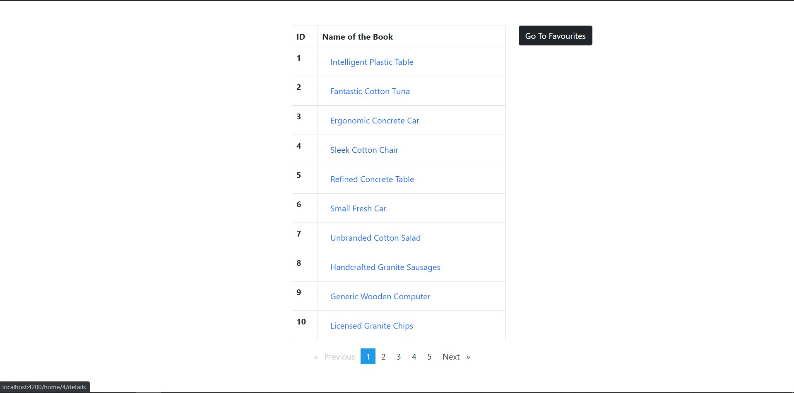
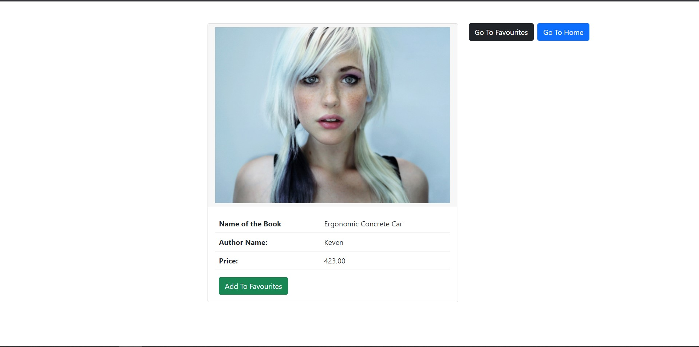
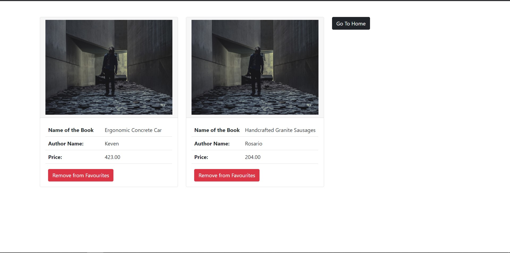

# CrudApp

## About

This is a CRUD Application using `Angular`. Where I used a mock API to get Database of books. For styling I used `Bootstrap`

### Link to the Mock API: [Mock API](https://609cd6ba04bffa001792d638.mockapi.io/books)

## What was Done

Methods developed in this project

- Getting All Books
- Getting a Specific Book (When user clicks on specified book name)
- Adding to Favourites
- Removing from Favourites

## Images

- Home Page

  

- Details Page

  

- Favourites Page

  

## To start the project

Run `npm install` in the terminal window, it will install the necessary dependencies.

## Development server

Run `ng serve` for a dev server. Navigate to `http://localhost:4200/`. The app will automatically reload if you change any of the source files.
